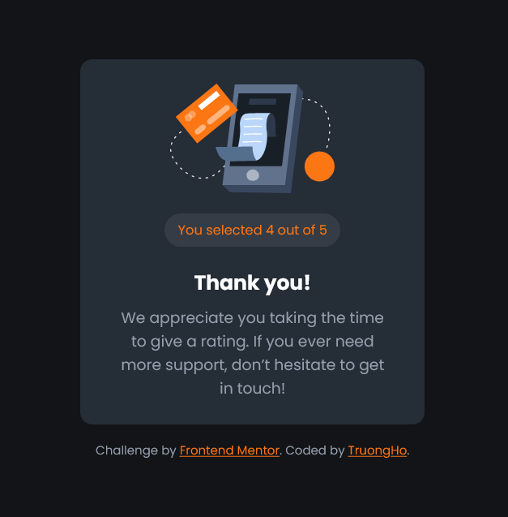

# Frontend Mentor - Interactive rating component solution

This is a solution to the [Interactive rating component challenge on Frontend Mentor](https://www.frontendmentor.io/challenges/interactive-rating-component-koxpeBUmI). Frontend Mentor challenges help you improve your coding skills by building realistic projects.

### The challenge

Users should be able to:

- View the optimal layout for the app depending on their device's screen size
- See hover states for all interactive elements on the page
- Select and submit a number rating
- See the "Thank you" card state after submitting a rating

### Screenshot




### Built with

- HTML - CSS - JS

```html
<div class="container">
  <div class="submit-card">
    <form>
      
      <h3 class="title">How did we do?</h3>
      <p class="para">
        Please let us know how we did with your support request. All feedback is
        appreciated to help us improve our offering!
      </p>
      <div class="buttons">
        <button type="button">1</button>
        <button type="button">2</button>
        <button type="button">3</button>
        <button type="button">4</button>
        <button type="button">5</button>
      </div>
      <button type="submit" class="submit-btn">Submit</button>
    </form>

    <div class="thank-container hide">
      
      <p class="selected-star">You selected <span></span> out of 5</p>
      <h3 class="title">Thank you!</h3>
      <p class="para">
        We appreciate you taking the time to give a rating. If you ever need
        more support, don’t hesitate to get in touch!
      </p>
    </div>
  </div>

  <div class="attribution">
    Challenge by
    <a href="https://www.frontendmentor.io?ref=challenge" target="_blank"
      >Frontend Mentor</a
    >. Coded by <a href="#">TruongHo</a>.
  </div>
</div>
```

```css
@import url('https://fonts.googleapis.com/css2?family=Poppins:wght@300;400;700&display=swap');

:root {
  --color-primary: hsl(25, 97%, 53%);
  --color-white: hsl(0, 0%, 100%);
  --color-light-grey: hsl(217, 12%, 63%);
  --color-medium-grey: hsl(216, 12%, 54%);
  --color-dark-grey: hsl(216, 12%, 24%);
  --color-dark-blue: hsl(213, 19%, 18%);
  --color-very-dark-blue: hsl(216, 12%, 8%);
}

* {
  margin: 0;
  padding: 0;
  box-sizing: border-box;
}
body {
  font-family: 'Poppins', sans-serif;
  background-color: var(--color-very-dark-blue);
  color: var(--color-white);
}

.container {
  width: 90%;
  height: 100vh;
  margin-inline: auto;
  display: flex;
  flex-direction: column;
  align-items: center;
  justify-content: center;
  gap: 1rem;
}

.submit-card {
  width: 340px;
  height: 360px;
  border-radius: 0.75rem;
  background-color: var(--color-dark-blue);
  position: relative;
  overflow: hidden;
}

form {
  position: absolute;
  top: 0;
  left: 0;
  width: 100%;
  height: 100%;
  padding: 1.25em;
  display: flex;
  flex-direction: column;
  transition: all 200ms ease-in-out;
}

form.hide {
  translate: -100% 0;
  opacity: 0;
}

form .icon-star {
  width: 32px;
  height: 32px;
  padding: 0.5rem;
  border-radius: 100%;
  background-color: var(--color-dark-grey);
  display: flex;
  align-items: center;
  justify-content: center;
  margin-bottom: 1rem;
}

.title {
  font-size: 20px;
  font-weight: 700;
  margin-bottom: 0.5rem;
}

.para {
  font-size: 15px;
  color: var(--color-light-grey);
  margin-bottom: 1rem;
}

form .buttons {
  width: 100%;
  display: flex;
  justify-content: space-between;
  margin-bottom: 1rem;
  margin-top: auto;
}

.buttons button {
  width: 50px;
  aspect-ratio: 1;
  border-radius: 100%;
  background: var(--color-dark-grey);
  outline: none;
  border: none;
  cursor: pointer;
  color: var(--color-light-grey);
  transition: all 300ms ease-in-out;
  font-weight: 700;
  font-family: inherit;
}

.buttons button:hover {
  background: var(--color-light-grey);
  color: var(--color-white);
}

.buttons button.active {
  background: var(--color-primary);
  color: var(--color-white);
}

.submit-btn {
  background: var(--color-primary);
  color: var(--color-white);
  border: none;
  outline: none;
  border-radius: 1000px;
  padding: 0.75em;
  text-transform: uppercase;
  font-size: 14px;
  font-weight: 700;
  font-family: inherit;
  letter-spacing: 1px;
  transition: all 300ms ease-in-out;
  cursor: pointer;
}

.submit-btn:hover {
  background: var(--color-light-grey);
}

.thank-container {
  position: absolute;
  width: 100%;
  height: 100%;
  padding: 2em;
  display: flex;
  flex-direction: column;
  align-items: center;
  justify-content: center;
  transition: all 200ms ease-in-out;
}

.thank-container.hide {
  translate: 100% 0;
}

.thank-container .selected-star {
  color: var(--color-primary);
  background-color: var(--color-dark-grey);
  border-radius: 1000px;
  font-size: 13px;
  padding: 0.5em 1em;
  margin-block: 1.25rem;
}

.thank-container .para {
  text-align: center;
  margin-bottom: 0;
}

.attribution {
  font-size: 12px;
  color: var(--color-light-grey);
}

.attribution a {
  color: var(--color-primary);
}
```

```js
const buttons = document.querySelectorAll('.buttons button')
const submitButton = document.querySelector('.submit-btn')
const form = document.querySelector('form')
const thank = document.querySelector('.thank-container')
const para = document.querySelector('form .para')
const selectedStar = document.querySelector('.selected-star span')

let selected = ''

buttons.forEach((button) =>
  button.addEventListener('click', () => {
    let current = document.querySelectorAll('.buttons button.active')
    if (current.length > 0) {
      current[0].classList.remove('active')
    }
    button.classList.add('active')
    selected = button.innerHTML
  })
)

submitButton.addEventListener('click', (e) => {
  e.preventDefault()
  let current = document.querySelectorAll('.buttons button.active')
  if (current.length === 0) {
    para.textContent = 'Oop! You forgot give us a star!'
  } else {
    form.classList.add('hide')
    thank.classList.remove('hide')
    selectedStar.textContent = selected
  }
})
```

If you want more help with writing markdown, we'd recommend checking out [The Markdown Guide](https://www.markdownguide.org/) to learn more.

**Note: Delete this note and the content within this section and replace with your own learnings.**

### Continued development

Use this section to outline areas that you want to continue focusing on in future projects. These could be concepts you're still not completely comfortable with or techniques you found useful that you want to refine and perfect.

**Note: Delete this note and the content within this section and replace with your own plans for continued development.**

### Useful resources

- [Example resource 1](https://www.example.com) - This helped me for XYZ reason. I really liked this pattern and will use it going forward.
- [Example resource 2](https://www.example.com) - This is an amazing article which helped me finally understand XYZ. I'd recommend it to anyone still learning this concept.

**Note: Delete this note and replace the list above with resources that helped you during the challenge. These could come in handy for anyone viewing your solution or for yourself when you look back on this project in the future.**

## Author

- Website - [Add your name here](https://www.your-site.com)
- Frontend Mentor - [@yourusername](https://www.frontendmentor.io/profile/yourusername)
- Twitter - [@yourusername](https://www.twitter.com/yourusername)

**Note: Delete this note and add/remove/edit lines above based on what links you'd like to share.**

## Acknowledgments

This is where you can give a hat tip to anyone who helped you out on this project. Perhaps you worked in a team or got some inspiration from someone else's solution. This is the perfect place to give them some credit.

**Note: Delete this note and edit this section's content as necessary. If you completed this challenge by yourself, feel free to delete this section entirely.**
